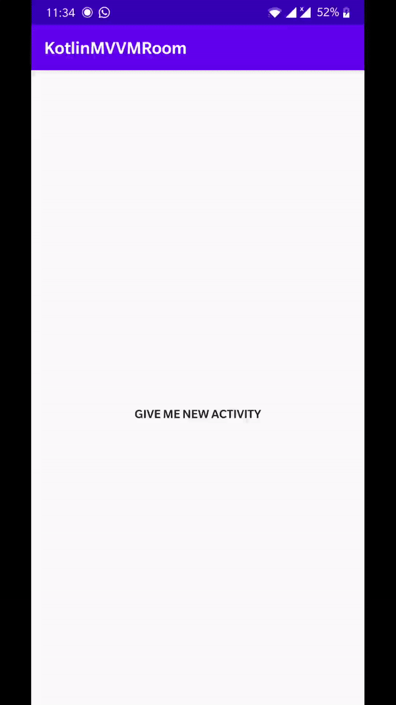
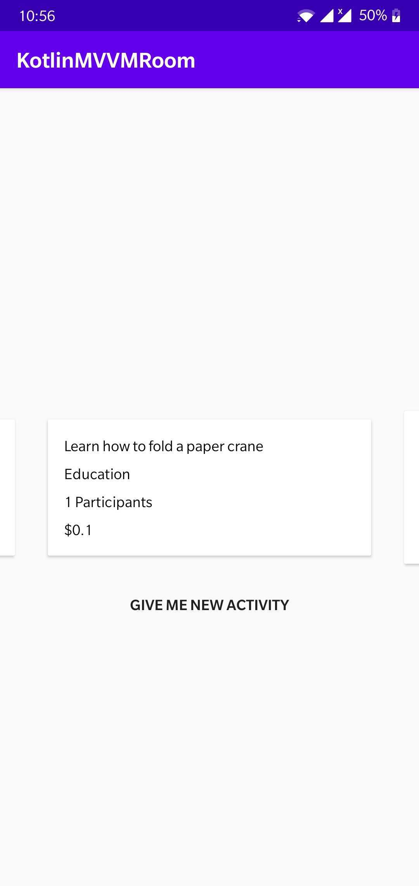
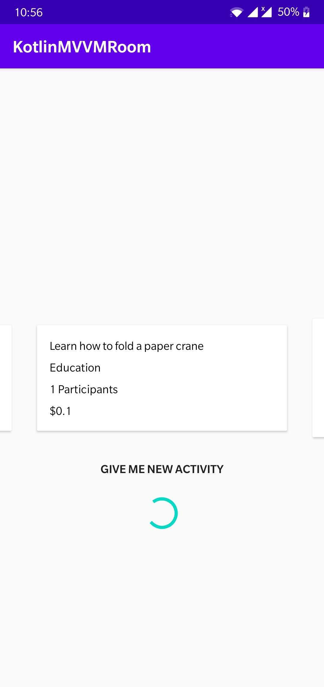
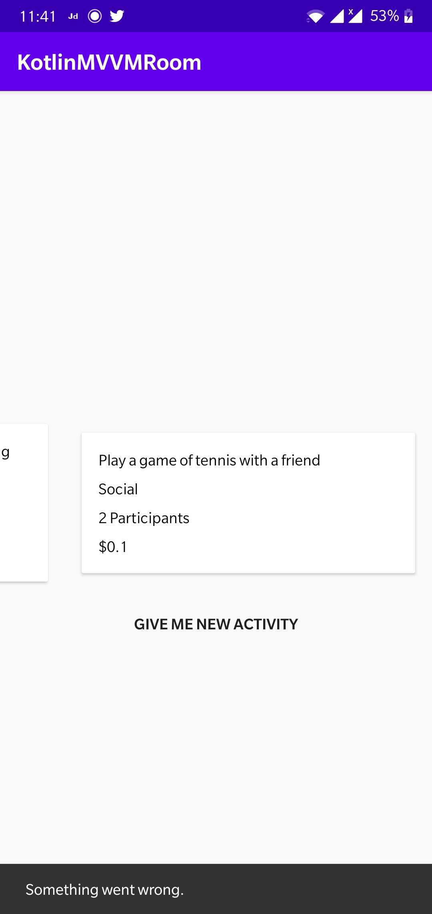

# Kotlin MVVM with Room

MVVM with Room sample in Kotlin using the components ViewModel, LiveData , Retrofit and Room. Here room is used for Local DB Caching.

## MVVM Pattern (Model View ViewModel)


## MVVM - Room Code

### Room Entity
```kotlin
@Entity(tableName = "activity_tabel")
data class BoredActivity(
    @SerializedName("accessibility")
    var accessibility: Double,
    @SerializedName("activity")
    var activity: String,
    @PrimaryKey(autoGenerate = false)
    @SerializedName("key")
    var key: String,
    @SerializedName("link")
    var link: String,
    @SerializedName("participants")
    var participants: Int,
    @SerializedName("price")
    var price: Double,
    @SerializedName("type")
    var type: String
)
```

### Room DAO
```kotlin
@Dao
interface ActivityDao{

    @Insert(onConflict = OnConflictStrategy.REPLACE)
    fun add(boredActivity: BoredActivity)

    @Query("DELETE FROM activity_tabel")
    fun deleteAllActivity()

    @Query("SELECT * FROM activity_tabel")
    fun getALlActivity() : LiveData<List<BoredActivity>>

}
```

### View Model
```kotlin
class BoredViewModel(val context: Application) : AndroidViewModel(context) {

    private val activityDatabase = ActivityDatabase.getInstannce(context)
    private val boredRepository = BoredRepository(activityDatabase.activityDao())

    private val _isLoading : MutableLiveData<Boolean> = MutableLiveData()
    val isLoading : LiveData<Boolean> get() = _isLoading

    val boredActivity : LiveData<List<BoredActivity>> get() =  boredRepository.getAllActivity()
    
    private val _isError : MutableLiveData<String> = MutableLiveData()
    val isError: LiveData<String> get() = _isError

    init {
        getBoredActivity()
    }

    fun getBoredActivity(){
        _isLoading.value = true
        boredRepository.getActivity().enqueue(object : Callback<BoredActivity>{
            override fun onResponse(call: Call<BoredActivity>, response: Response<BoredActivity>) {
                _isLoading.value = false
                if(response.isSuccessful){
                    response.body()?.let { boredRepository.addActivity(it) }
                } else {
                    _isError.value = context.getString(R.string.str_something_wrong)
                }
            }
            
            override fun onFailure(call: Call<BoredActivity>, t: Throwable) {
                _isLoading.value = false
                _isError.value = context.getString(R.string.str_something_wrong)
            }
        })
    }
}
```

### Activity
```kotlin
class MainActivity : AppCompatActivity() {

    lateinit var viewModel: BoredViewModel

    override fun onCreate(savedInstanceState: Bundle?) {
        super.onCreate(savedInstanceState)
        setContentView(R.layout.activity_main)
        viewModel = ViewModelProviders.of(this).get(BoredViewModel::class.java)
        // Initialize Recyclerview
        viewModel.isLoading.observe(this, Observer {
            // Show/Hide Loader
        })
        viewModel.isError.observe(this, Observer {
            // Show/Hide Error
        })
        viewModel.boredActivity.observe(this, Observer {boredActivity ->
            // Update Recyclerview
        })
        btnNewActivity.setOnClickListener {
            viewModel.getBoredActivity()
        }
    }
}
```
 
## Demo

 
 
## Screenshots

    

## Dependencies

- Retrofit 2 - [Version: 2.8.1](https://square.github.io/retrofit/)
- AndroidX - [Version: 1.2.0](https://mvnrepository.com/artifact/androidx)
- Arch Lifecycle - [Version: 2.2.0](https://developer.android.com/jetpack/androidx/releases/lifecycle)
- Room - [Version: 2.2.5](https://developer.android.com/topic/libraries/architecture/room)

> Any questions or comment is appreciated. If you find this useful, consider giving it a star.
> Create an issue for any questions.